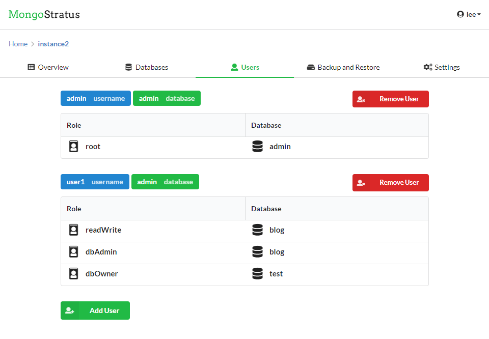

# mongo-stratus-connection-manager
MongoStratus Connection Manager

## Components
The Connection Manager is one of the components of MongoStratus. The other ones can be found at the following links:
* [Login Manager](https://github.com/vzat/mongo-stratus-login-manager)
* [Data Retriever](https://github.com/vzat/mongo-stratus-data-retriever)
* [Data Visualiser](https://github.com/vzat/mongo-stratus-data-visualiser)

## Description
Creating and maintaining MongoDB databases can be difficult and resource intensive. It is especially true for companies that are expanding fast and need scalable databases. This is what MongoStratus is aiming to fix.
The project’s goal is to provide a flexible and easy to use web service that developers at any experience level can use to setup and manage MongoDB databases. It allows customers to create multiple types of MongoDB databases in the cloud without having to manually set them up. Users are also provided with a clean and easy to use interface where they can view and manipulate data from their databases. In addition, customers are provided an API which can be used to access their data more easily.

## ScreenShots

### Login Page

### Registration Page

### Creating a new Instance Part 1

### Creating a new Instance Part 2

### Instance Overview

### Database List

### User List

### Backups

### Data Visualiser

## Logos Source
Google Cloud Platform - https://2017.jsconf.eu/sponsors/google-cloud.html

Microsoft Azure - https://worldvectorlogo.com/logo/microsoft-azure-2

Amazon Web Services - https://worldvectorlogo.com/logo/amazon-web-services
